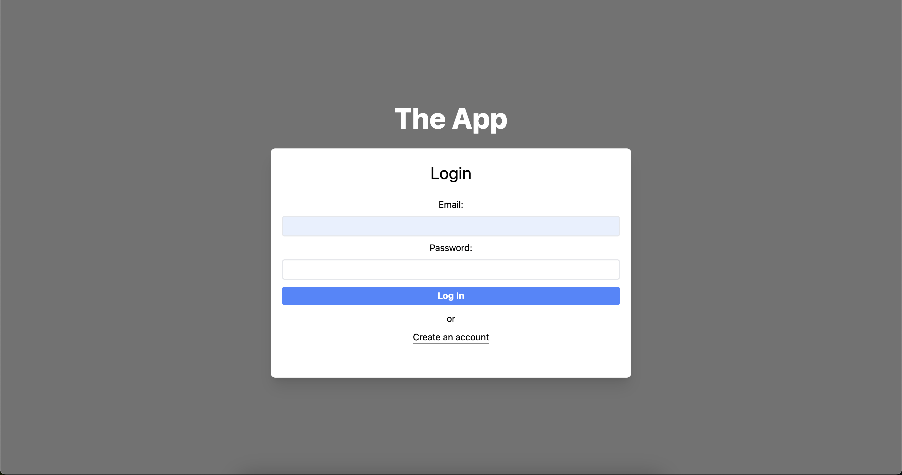
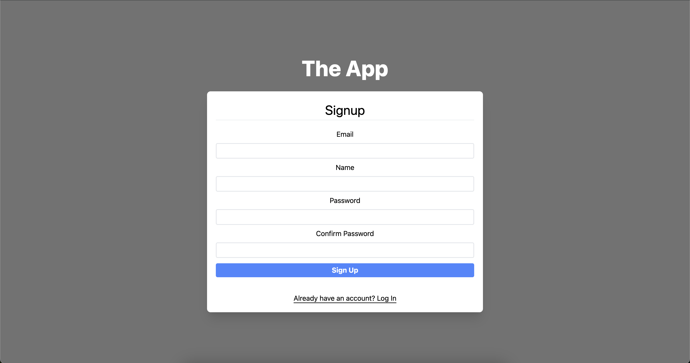
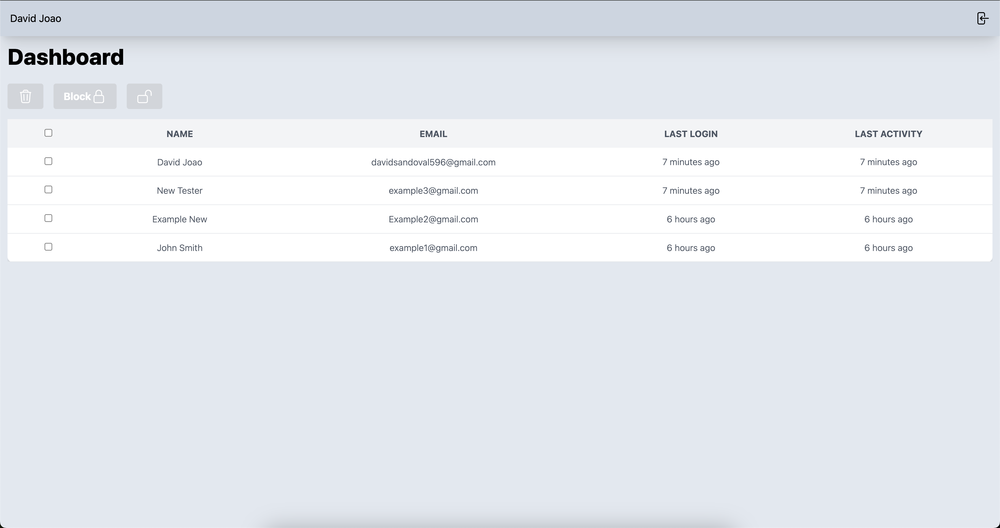
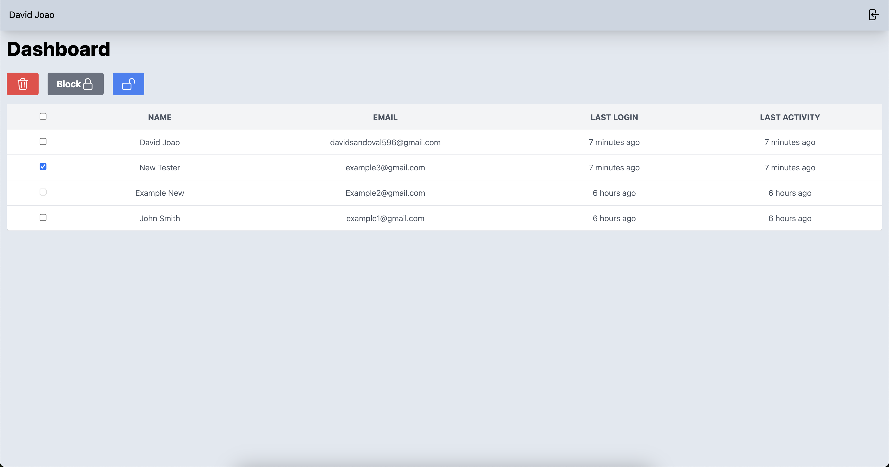
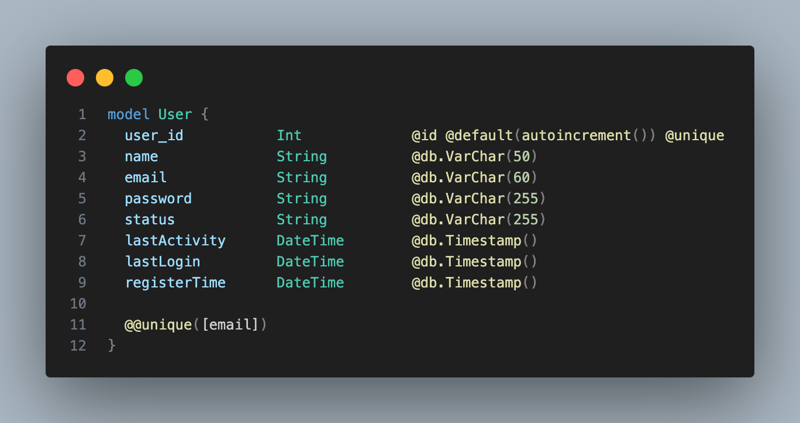

## Getting Started: The App ( ITransition Task #4)

## Open [The App](https://the-app-chi.vercel.app/) with your browser to see the result.

One of the example accounts:

 - Email: example1@gmail.com 
 - Password: 123

## Technologies Used
 - React
    - Next.js
    - Next/auth (jwt auth)
 - HTML
 - CSS
    - TailwindCSS
 - Node.js
 - PostgreSQL
    - Hosted in Neon PostgreSQL

## User Stories

- As an User, I want to signup/login in the website.
- As an User, I want to access the web application through my phone and computer.
- As an User, I want to use short password, even with one character.
- As an User, I want to have a dashboard with functions such as block/unblock other users and delete them.
- As an User, I want to be able to terminate my session by logging out.

## Developer Requirements

- Add unique index to database;
- Propierties: Unique index (email), encrypted password, last activity, last login, name.
- Table should look like a table, and toolbar like a toolbar.
- Multiple selection with checkboxes, as well as "Select All" option.
- Check before logging in for deleted/blocked account.
- Dashboard only accessible by authenticated users.
- All users should be able to delete themselves or other users.

## Screenshots

## Unique Indexation Proof

